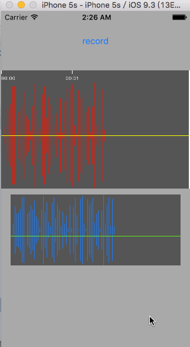

# AudioWave

[](https://github.com/Carthage/Carthage)

support: >=iOS8
Xcode: >= 7.3

## Features
audio's wave

## Preview


### Carthage

[Carthage](https://github.com/Carthage/Carthage) is a decentralized dependency manager that builds your dependencies and provides you with binary frameworks.

You can install Carthage with [Homebrew](http://brew.sh/) using the following command:

```bash
$ brew update
$ brew install carthage
```

To integrate Alamofire into your Xcode project using Carthage, specify it in your `Cartfile`:

```ogdl
github "easyui/SwiftMan" ~> 3.4
```

Run `carthage update` to build the framework and drag the built `SwiftMan.framework` into your Xcode project.

### demo

code：
    
           self.audioWave?.dataSource = nil
        self.audioWave?.stop()
        self.audioWave?.removeFromSuperview()
        self.audioWave = nil
        self.audioWave = AudioWave(frame: CGRectMake(self.waveContainer.bounds.origin.x, self.waveContainer.bounds.origin.y, self.waveContainer.bounds.size.width - 2, self.waveContainer.bounds.size.height))
        self.waveContainer.addSubview(self.audioWave!)
        self.audioWave?.intervalTime = 0.025
        self.audioWave?.sampleWidth = 3
        self.audioWave?.dataSource = self
        self.audioWave?.start()   
        

xib：

        @IBOutlet weak var audioWaveFromXib: AudioWave!
        ......
        self.audioWaveFromXib?.dataSource = self
        self.audioWaveFromXib?.start()


